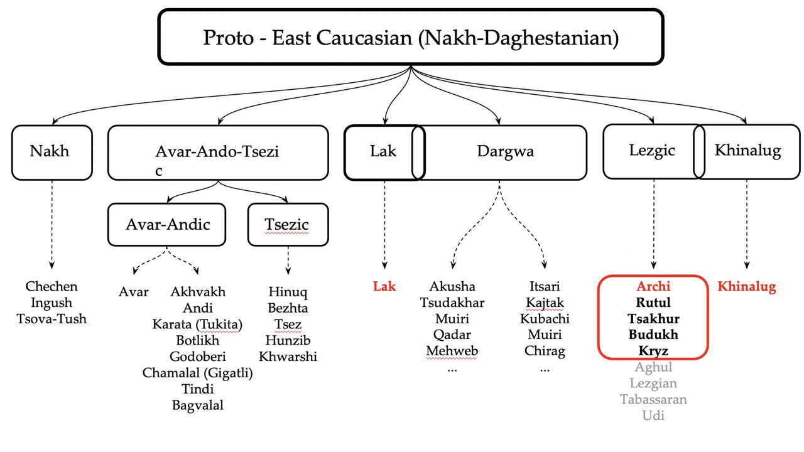

```{r setup, include=FALSE}
knitr::opts_chunk$set(echo = TRUE, warning = FALSE, message = FALSE)
```

```{r}
library(tidyverse)
library(caret)
library(pROC)
library(readxl)
library(jtools)
library(randomForest)
library(stringi)
```

## Outline of the project

Some East Caucasian languages feature 4-value gender systems: gender 1 is for male referents, gender 2 is for female referents and genders 3 & 4 are for the rest. Human genders show transparent assignment rules, assignment of nouns to non-human genders is opaque.

In this project, I want to explore a few factors that are potentially meaningful for assignment to Gender 3 and Gender 4. It could be the case, that special rules of assignment operate over:

-   loanwords
-   compounds
-   words that start with some particular phoneme
-   words that denote things which are remarkably small
-   words that denote things which are remarkably large

I test the data of 4-gendered Lezgic languages (Archi, Rutul, Tsakhur, Budukh and Kryz) and two 4-gendered languages which are not Lezgic but are heavily-influenced by Lezgic.



I will first run **chi-square** test to see if any of the factors above and gender values are not independent.

Then, I run **LogReg** and **Random Forest**\*\*.

In the end, I plot RocAuc to see which of the two methods above perform better.

## Data

The data consists of:

-   a list of concepts where each of the meanings is annotated as being Large of Small; built along the lines of Conceptual Properties Norming studies (Popova, Buzanov, Daniel & Voloshina in prep.)
-   translation equivalents for these concepts in 7 languages
-   annotation of words: first phoneme, loanwords, compounds, gender values

#### Mapping concepts to words

```{r}
big.concepts <- read_excel("big itog.xlsx")
small.concepts <- read_excel("small itog.xlsx")

big.concepts %>% 
  filter(`MA&R FREQ` > 0) -> big.concepts #filter out the concepts collected experimentally by collegues and me
small.concepts %>% 
  filter(`MA&R FREQ` > 0) -> small.concepts
```

```{r}
big.concepts$size <- "BIG" #tag concepts as either Big or Small
small.concepts$size <- "SMALL"

concepts <- bind_rows(big.concepts, small.concepts) #now we store 'concepts' as one file
```

Big and Small things split in half in our dataset:

```{r}
concepts %>% 
  ggplot(aes(size, fill=size)) +
    geom_bar() +
    theme_minimal()
```

```{r}
words <- data.frame()

for (lang in c("archi", "lak", "tsakhur", "rutul",
               "budukh", "kryz", "khinalug")) {
  df <- read_excel(
    sprintf(
      "%s revised may.xlsx", lang # these are 7 excel files with words from 7 languages and annotation
    )
  )
  
  df$language <- lang
  df$gender <- as.character(df$gender)
  
  words <- bind_rows(words, df) # assign translation equivalents to all the concepts on the list, extract gender values
}

```

```{r}
words %>% 
  filter(gender %in% c("3", "4")) %>% 
  mutate(gender = as.numeric(gender)) -> words #getting rid of the noise, leaving only words which are either gender 3 or gender 4
```

```{r}
merge(concepts, words, by = "concept") %>% 
  select(size, gender, `f compound`, `f loan`,
         russian.x, language, concept, word) %>% 
  replace(is.na(.), "no") -> data #add annotation of compounds and loans, indicate which items are neither compounds nor loans.
```

```{r}
data %>% 
  ggplot(aes(language, fill=as.character(gender))) +
    geom_bar() +
    labs(fill = "gender")
```

#### First phoneme annotation

```{r}
data %>% 
  mutate(word = stri_trans_general(tolower(word), "cyrillic-latin"),
         first_ph = substr(word, 1, 1)
  ) -> data #lowercase, translitirate, pick out the first symbol
```

```{r}
unique(data$first_ph)
```

```{r}
mapping <- c(
  z="fric", n="ant", k="plos", d="ant", m="lab", p="lab",
  b="lab", č="ant", ç="ant", s="ant", χ="fric", c="ant",
  t="ant", g="plos", v="lab", l="liq", š="ant", q="plos",
  j="ant", a="vow", i="vow", o="vow", f="fric", ʕ="fric",
  h="fric", ş="fric", u="vow", r="liq", w="lab", y="vow",
  ɬ="liq", ž="ant", â="vow", ë="vow", x="fric"
) #annotating possible first phonemes as either fricative, anterior, labial, plosive, liquid or vowel
```

```{r}
data %>% 
  mutate(first_ph_class = mapping[first_ph]) -> data #adding annotation to the data
```

#### Compounds and Loans: are they even present in the data?

```{r}
data %>% 
  ggplot(aes(`f compound`, fill=as.character(gender)))+
    geom_bar() + 
    facet_wrap(~`f compound`, scales="free") +
    labs(fill="gender")
```

```{r}
data %>% 
  ggplot(aes(`f loan`, fill=as.character(gender)))+
    geom_bar() +
    facet_wrap(~language, scales="free") +
    labs(fill="gender")
```

## Chi-sqaure

### Chi-square test: loanwords

No skewing!

```{r}
for (lang in unique(data$language)) {
  data %>% 
    filter(language == lang) -> df
  
    res <- chisq.test(df$gender, df$`f loan`)
    
    print(sprintf("%s language: p-value = %s", lang, res$p.value))
}
```

### Chi-square test: first phoneme class

No skewing!

```{r}
data %>% 
  ggplot(aes(first_ph_class, fill=as.character(gender)))+
    geom_bar() +
    facet_wrap(~language, scales="free") +
    labs(fill="gender")
```

```{r}
for (lang in unique(data$language)) {
  data %>% 
    filter(language == lang) -> df
  
    res <- chisq.test(df$gender, df$first_ph_class)
    
    print(sprintf("%s language: p-value = %s", lang, res$p.value))
}
```

### Chi-square test: size

No skewing!!! :(

```{r}
data %>% 
  ggplot(aes(size, fill=as.character(gender)))+
    geom_bar() +
    facet_wrap(~language, scales="free") +
    labs(fill="gender")
```

```{r}
for (lang in unique(data$language)) {
  data %>% 
    filter(language == lang) -> df
  
    res <- chisq.test(df$gender, df$size)
    
    print(sprintf("%s language: p-value = %s", lang, res$p.value))
}
```

## LogReg results

Apparently, the only meaningful factor which helps predicting gender value is **bi-liabial inital phoneme** for **Archi** and **Lak**. If the word starts with [p], [b], or [m] it is likely to belong to Gender 3.

```{r}

for (lang in unique(data$language)) {
  data %>% 
    filter(language == lang) -> df
  
  fit <- glm(data=df, as.factor(gender) ~ size + first_ph_class + `f loan`,
             family = "binomial")
  
  cat("-----------\n")
  cat(lang)
  cat("\n-----------\n\n\n")
  print(summ(fit))
  
  pred_proba <- predict(fit, df, type = "response")
  
  cm <- confusionMatrix(as.factor(as.numeric(pred_proba>0.5) + 3), as.factor(df$gender))
  cat("\n\n\n\n")
  print(cm)
  cat("\n\n\n\n")
}
```

## Random Forest: results

In all languages except Kryz and Rutul, accuracy suffers from excluding the **initial phoneme** parameter. The only language, where the model suffers from excluding **size** parameter is Lak. **Loanwords** are not important in neither languages.

```{r}
for (lang in unique(data$language)) {
  data %>% 
    filter(language == lang) -> df
  
  names(df) <- str_replace(names(df), " ", "_")
  
  model.forest <- randomForest(data=df,
                               as.factor(gender) ~ size + first_ph_class + f_loan,
                               importance = TRUE)
  
  pred_proba <- predict(model.forest, df, type="prob")
  pred_proba <- as_tibble(pred_proba)$`4`
  
  cm <- confusionMatrix(as.factor(as.numeric(pred_proba>0.3) + 3), as.factor(df$gender))
  cat("\n\n\n\n")
  print(cm)
  cat("\n\n\n\n")

  importance.forest <- as.data.frame(importance(model.forest))
  importance.forest$vars <- row.names(importance.forest)
  

  ggplot(importance.forest, aes(x=vars, y=MeanDecreaseAccuracy)) +
    geom_point(aes(size = MeanDecreaseAccuracy), color="blue", alpha=0.6) +
    xlab("Variable") +
    ylab(sprintf("%s: Mean Decrease Accuracy", lang)) +
    theme_light() +
    coord_flip() -> g

  plot(g)
}
```

## ROC AUC: results

For all languages, the performance quality of two classifiers is pretty similar.

```{r}
for (lang in unique(data$language)) {
  data %>% 
    filter(language == lang) -> df
  
  names(df) <- str_replace(names(df), " ", "_")
  
  log.reg <- glm(data=df, as.factor(gender) ~ size + first_ph_class + f_loan,
             family = "binomial")
  
  predict.log.reg <- predict(log.reg, df, type = "response")
  
  model.forest <- randomForest(data=df,
                               as.factor(gender) ~ size + first_ph_class + f_loan,
                               importance = TRUE)
  
  predict.rf <- predict(model.forest, df, type="prob")
  predict.rf <- as_tibble(predict.rf)$`4`
  
  log.roc_res <- roc(as.numeric(as.factor(df$gender)),
                     predict.log.reg + 1, algorithm=1)
  
  rf.roc_res <- roc(as.numeric(as.factor(df$gender)),
                    predict.rf + 1, algorithm=1)
  
  g <- ggroc(list(LogReg=log.roc_res, RF=rf.roc_res)) +
    labs(color="model") +
    theme_minimal() +
    ggtitle(sprintf("%s, LogReg AUC = %s, RF AUC = %s",
                    lang, round(log.roc_res$auc, 2),
                    round(rf.roc_res$auc, 2)))
  plot(g)
}


```
